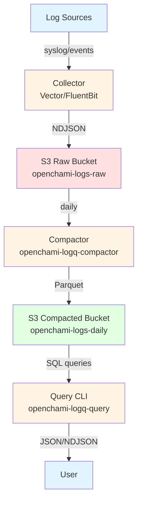
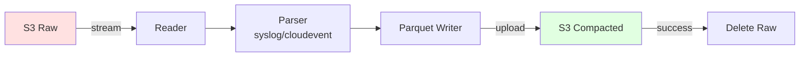
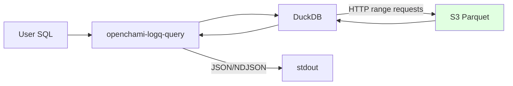
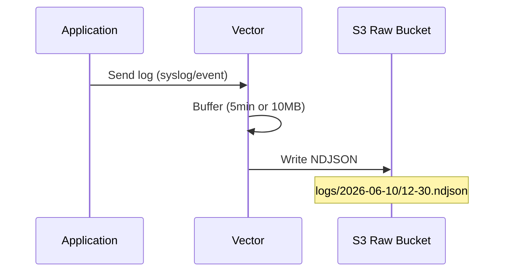
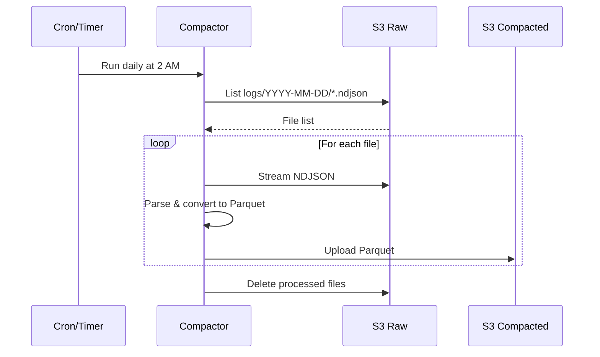
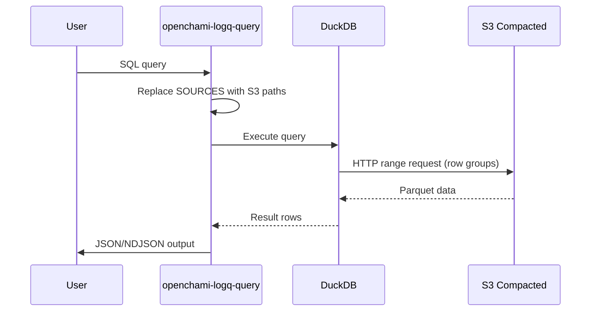
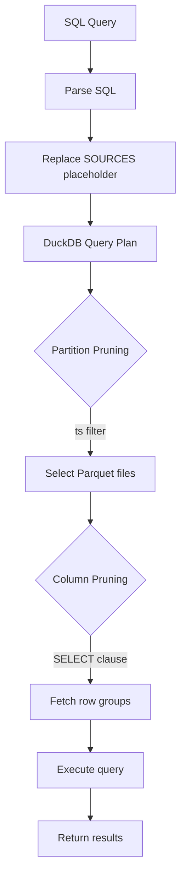

<!--
SPDX-FileCopyrightText: Copyright © 2026 OpenCHAMI a Series of LF Projects, LLC

SPDX-License-Identifier: MIT
-->

# Architecture

Technical architecture and design decisions for openchami-logq.

## Table of Contents

1. [System Overview](#system-overview)
2. [Architecture Principles](#architecture-principles)
3. [Component Architecture](#component-architecture)
4. [Data Flow](#data-flow)
5. [Storage Architecture](#storage-architecture)
6. [Query Architecture](#query-architecture)
7. [Technology Choices](#technology-choices)

---

## System Overview

### Purpose

openchami-logq is a lightweight log lake system for HPC environments providing:
- **Cheap storage** for all logs and events
- **Fast queries** using SQL
- **Schema flexibility** for evolving log formats
- **Zero maintenance** - no clusters, no indices

### Design Philosophy

1. **Storage First** - Never lose data, optimize for cost
2. **Query Second** - Fast enough for ad-hoc analysis
3. **Simple Always** - Minimal setup and maintenance
4. **HPC Aware** - Built for distributed systems

### System Diagram



---

## Architecture Principles

### 1. Append-Only Storage

**Decision:** Never delete or modify raw logs.

**Rationale:**
- Logs are immutable evidence
- Storage is cheap (~$0.02/GB/month)
- Deletion risks losing critical data

**Implementation:**
- Raw logs stored as-is in NDJSON
- Compaction creates new files, doesn't modify originals
- Original deletion only after successful compaction

### 2. Schema-on-Read

**Decision:** No schema validation during ingestion.

**Rationale:**
- Log formats evolve over time
- Schema validation can cause data loss
- Better to store everything and parse later

**Implementation:**
- Collector writes raw JSON/syslog without validation
- Compactor does best-effort field extraction
- Query engine handles missing/extra fields gracefully

### 3. Separation of Concerns

**Decision:** Separate components for collection, storage, compaction, and querying.

**Rationale:**
- Each component can scale independently
- Failures in one don't affect others
- Easier to maintain and debug

**Implementation:**
- Collector: Vector/FluentBit (external dependency)
- Storage: S3-compatible (external dependency)
- Compactor: Go binary, runs on schedule
- Query: Go CLI, runs on-demand

### 4. Direct S3 Access

**Decision:** Query Parquet files directly from S3 without copying.

**Rationale:**
- No local storage required
- Leverages DuckDB's S3 integration
- Reduces operational complexity

**Implementation:**
- DuckDB reads Parquet from S3 via HTTP range requests
- Only fetches required row groups and columns
- No intermediate database or cache

---

## Component Architecture

### Collector (Vector/FluentBit)

**Responsibility:** Accept logs and write to S3 raw bucket.

**Key Characteristics:**
- External dependency (not part of this project)
- Configured via YAML
- Writes NDJSON format
- Batches writes (5-10MB or 5 minutes)

**Configuration:**
```yaml
# See collector/vector.yaml for full example
sinks:
  s3:
    type: aws_s3
    bucket: openchami-logs-raw
    key_prefix: logs/
    encoding:
      codec: ndjson
```

### Compactor

**Responsibility:** Convert raw NDJSON to optimized Parquet.

**Key Characteristics:**
- Go binary (~10MB)
- Runs daily via cron/timer
- Stateless (no local database)
- Streaming architecture (constant memory)

**Architecture:**



**Parsing Strategy:**
- Detect format (syslog vs cloudevent) from first field
- Extract common fields: `ts`, `host`, `level`, `msg`
- Store unknown fields in `data` JSON column
- Never fail on parse errors (store as-is)

### Query Engine

**Responsibility:** Execute SQL queries against Parquet files.

**Key Characteristics:**
- Go binary with embedded DuckDB
- Stateless (no local database)
- Reads directly from S3
- Outputs JSON or NDJSON

**Architecture:**



**Query Pattern:**
```sql
-- SOURCES is replaced with actual S3 paths
SELECT * FROM SOURCES WHERE ts > '2026-06-10'

-- Becomes:
SELECT * FROM read_parquet('s3://bucket/logs/2026-06-10/*.parquet')
```

---

## Data Flow

### Ingestion Flow



**Path Pattern:** `logs/YYYY-MM-DD/HH-MM.ndjson`

**File Size:** Typically 5-10MB (5 minutes of logs)

### Compaction Flow



**Path Pattern:** `logs/YYYY-MM-DD.parquet`

**Compression:** Typically 10:1 (100MB NDJSON → 10MB Parquet)

### Query Flow



**Optimization:** DuckDB only fetches required columns and row groups (partition pruning).

---

## Storage Architecture

### S3 Bucket Structure

```
openchami-logs-raw/
├── logs/
│   ├── 2026-06-10/
│   │   ├── 00-00.ndjson
│   │   ├── 00-05.ndjson
│   │   └── ...
│   └── 2026-06-11/
│       └── ...
└── events/
    └── 2026-06-10/
        └── ...

openchami-logs-daily/
├── logs/
│   ├── 2026-06-10.parquet
│   ├── 2026-06-11.parquet
│   └── ...
└── events/
    ├── 2026-06-10.parquet
    └── ...
```

### Data Formats

#### Raw Format (NDJSON)

**Syslog:**
```json
{"ts":"2026-06-10T12:00:00Z","host":"node01","level":"INFO","msg":"Started"}
{"ts":"2026-06-10T12:00:01Z","host":"node02","level":"ERROR","msg":"Failed"}
```

**CloudEvents:**
```json
{"specversion":"1.0","type":"system.event","source":"/node01","time":"2026-06-10T12:00:00Z","data":{...}}
```

#### Compacted Format (Parquet)

**Schema:**
```
ts: TIMESTAMP
host: VARCHAR
level: VARCHAR
msg: VARCHAR
data: JSON
source: VARCHAR (cloudevents)
type: VARCHAR (cloudevents)
```

**Advantages:**
- Columnar format (only read needed columns)
- Compressed (zstd compression)
- Row group pruning (skip files/groups outside time range)
- Metadata (min/max timestamps for partition pruning)

### IAM Model

Three IAM users with minimal permissions:

**log-writer** (Collector):
- `s3:PutObject` on raw bucket

**log-compactor** (Compactor):
- `s3:GetObject`, `s3:ListBucket` on raw bucket
- `s3:PutObject` on compacted bucket
- `s3:DeleteObject` on raw bucket (post-compaction)

**log-reader** (Query):
- `s3:GetObject`, `s3:ListBucket` on compacted bucket

---

## Query Architecture

### DuckDB Integration

**Why DuckDB:**
- Embedded (no server process)
- Native S3 support with HTTP range requests
- Columnar engine optimized for analytics
- Full SQL support (window functions, CTEs, etc.)
- Apache Arrow integration

**Query Execution:**



### SOURCES Placeholder

**User Query:**
```sql
SELECT * FROM SOURCES WHERE ts > '2026-06-10'
```

**Actual Query:**
```sql
SELECT * FROM read_parquet([
  's3://openchami-logs-daily/logs/2026-06-10.parquet',
  's3://openchami-logs-daily/logs/2026-06-11.parquet',
  ...
])
WHERE ts > '2026-06-10'
```

**Scope Options:**
- `--scope compacted`: Query Parquet files (default, fast)
- `--scope raw`: Query NDJSON files (recent data)
- `--scope all`: Query both (complete data)

### Query Optimization

**Partition Pruning:**
- Files named by date (`2026-06-10.parquet`)
- WHERE clause on `ts` filters files before reading
- Parquet metadata (min/max `ts`) enables row group skipping

**Column Pruning:**
- Columnar format only reads selected columns
- `SELECT ts, msg` reads 2 columns, not all

**Predicate Pushdown:**
- DuckDB pushes filters to Parquet reader
- Filters applied during scan, not after

---

## Technology Choices

### Why S3?

**Pros:**
- Industry standard (AWS, MinIO, VersityGW all compatible)
- Cheap storage (~$0.02/GB/month)
- No operational overhead (managed service or simple self-hosted)
- HTTP-based (works through firewalls)

**Cons:**
- Higher latency than local disk (50-100ms)
- Request costs (mitigated by batching)

**Decision:** Storage cost and simplicity outweigh latency concerns for log analytics.

### Why NDJSON?

**Pros:**
- Human-readable (debugging friendly)
- Streamable (process line-by-line)
- Schema-flexible (JSON supports any structure)
- Universal (every language has JSON support)

**Cons:**
- Larger than binary formats
- Slower to parse than binary

**Decision:** Schema flexibility and debuggability more important than size/speed for raw logs.

### Why Parquet?

**Pros:**
- Columnar format (efficient for analytics)
- Excellent compression (10:1 typical)
- Self-describing (schema embedded)
- Industry standard (Spark, DuckDB, Snowflake all support)
- Partition pruning (skip files/row groups)

**Cons:**
- Not human-readable
- Write-once (can't append)

**Decision:** Perfect fit for compacted, immutable log data.

### Why DuckDB?

**Pros:**
- Embedded (no server to manage)
- Native S3 support
- Full SQL support
- Columnar engine (fast aggregations)
- Small binary (~50MB)
- MIT license

**Cons:**
- Not distributed (single-node only)
- Embedded (can't share connections)

**Decision:** Simplicity and SQL compatibility more important than distributed queries for log analytics.

### Why Go?

**Pros:**
- Single binary (no dependencies)
- Fast compilation
- Good stdlib (HTTP, JSON, CLI)
- Cross-platform
- Memory safe

**Cons:**
- Verbose error handling
- No generics (until 1.18+)

**Decision:** Operational simplicity (single binary) is critical for HPC deployments.

### Why Vector/FluentBit?

**Decision:** Use existing, battle-tested collectors rather than building our own.

**Rationale:**
- Mature projects with wide adoption
- Support many log sources (syslog, journald, files, etc.)
- Built-in buffering and retry logic
- Active development and community

---

## Related Documentation

- **[User Guide](USER_GUIDE.md)** - Query patterns and SQL examples
- **[Operations Guide](OPERATIONS.md)** - Deployment and configuration
- **[Developer Guide](DEVELOPMENT.md)** - Development setup

---

**Questions?** Open an issue on [GitHub](https://github.com/OpenCHAMI/legendary-funicular/issues)!
